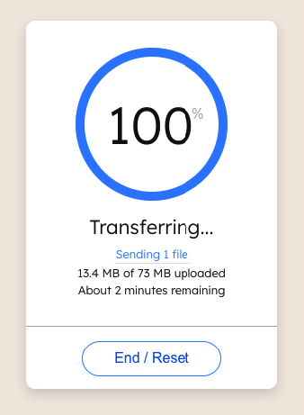

# WeTransfer BonFX Spinner



## Description

The WeTransfer BonFX Spinner is a recreation of the famous WeTransfer loading spinner at wetransfer.com which indicates the percentage of loading completion of the current uploading file.

It has a circular progressive indicator tied to the percent of the file loading (1-100%). In addition, the circular indicator itself has a spinning animation which creates some delight and interest while the user waits for the upload to complete.

The `Counter` component provides the simulated percent of upload completion through a setInterval

## Props

The LoadingSpinner component takes the following props

- `counter`: integer - value from 0 to 100 representing how much of a given file has uploaded, which populates the degrees used in the progress indicator part of the animation
- `isPlaying`: boolean - status indicating that `count` is progressing, used to reset the animation values during any percent of completion, or after completion at 100%
- `spinning`: boolean - status of CSS animation property that wraps the progressive indicator, where start and stop is tied to a button click

## Usage of LoadingSpinner

```
<LoadingSpinner
 counter={counter}
 isPlaying={isPlaying}
 spinning={spinning}
/>
```

### Static example

```
<LoadingSpinner
 counter={55}
 isPlaying={true}
 spinning={true}
/>
```

This project was bootstrapped with [Create React App](https://github.com/facebook/create-react-app)
